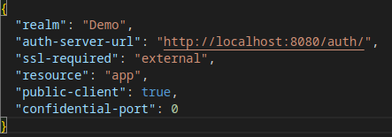
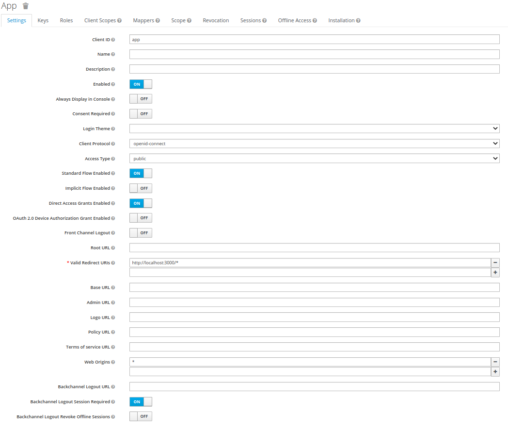
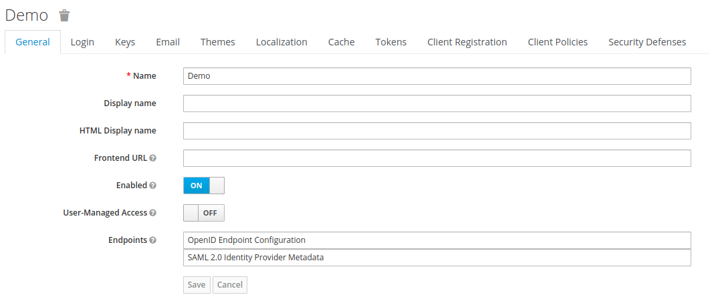
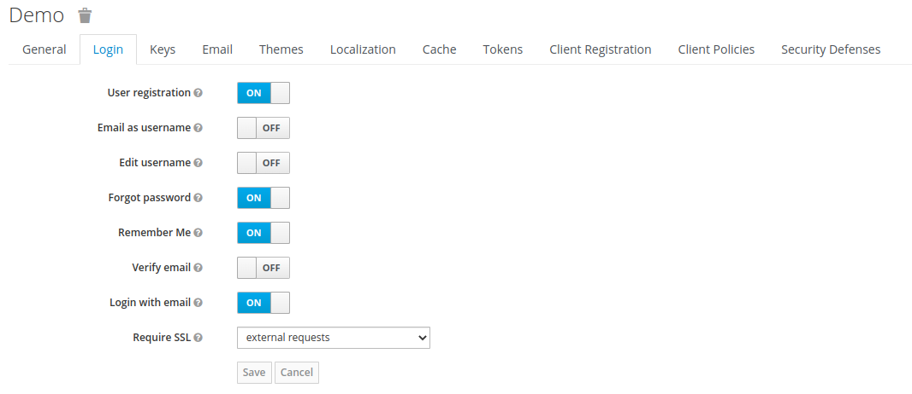
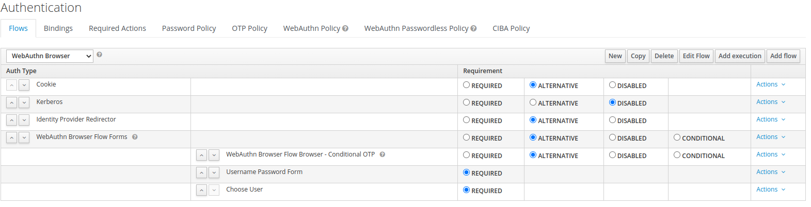
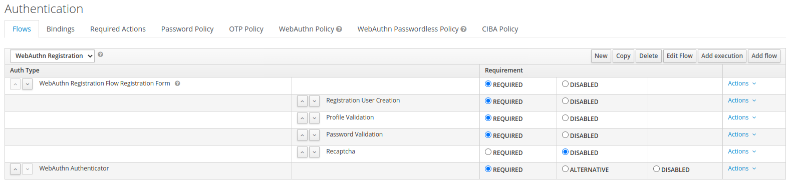

# RoadMap pour le plugin d'authentification adaptative au sein de Keycloak

## Utiliser WebAuthn pour envoyer les informations à Keycloak depuis React

\
Sur cette capture d'écran est affiché le fichier `keycloak.json`. Il permet de spécifier le realm auquel appartient l'utilisateur, et permettre de le rediriger vers celui-ci. En effet, le realm est indiqué dans l'URL après la connexion, juste après `http://localhost:8080/auth` qui est la redirection de base.

\
On voit que `"resource": "app"`, la capture d'écran ci-dessus indiquant la configuration de ce type d'utilisateur. On peut voir que cette configuration autorise la redirection depuis `http://localhost:3000/*`, qui est l'adresse d'hébergement de l'application React, ainsi que toute les pages découlantes de cette URL.

\
La configuration du realm `Demo` (indiqué sur le `keycloak.json`). On y indique seulement le nom, si il doit être activé, et ses endpoints (Possibilités de récupérer les fichiers).

\
La configuration du login du realm permet à un nouvel utilisateur de s'enregistrer (Possibilité de desactivation si on veut une création de compte utilisateur uniquement par l'administrateur), ainsi qu'un certain nombre de fonctionnalités, comme l'oubli de mot de passe, demander au navigateur de se souvenir de l'utilisateur, ou encore d'utiliser son email comme nom d'utilisateur.

\
Ici, copie de la browser base authentication, pour y ajouter l'exexcution de l'authenticator WebAuthn dans les requis.

\
ici, copie du registration flow de base, pour y ajouter WebAuthn Authenticator (Possibilité de ne pas le mettre en `required`).

## Ajouter plus d'informations à celles de base

## Analyser l'API REST afin d'ajouter des flows de manière programmique

## Adaptation dynamique, application de stratégie
